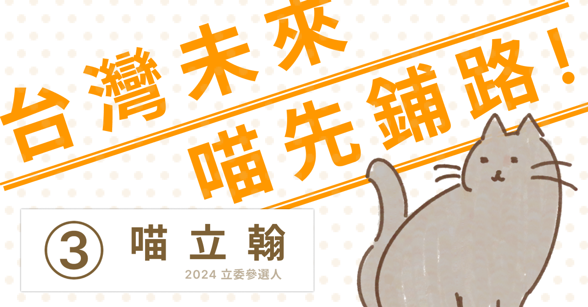

# Week 1 - The F2E 活動網站設計

## 比賽網址
參與The F2E 前端 & UI 修煉精神時光屋比賽 [https://2022.thef2e.com/](https://2022.thef2e.com/).

## 設計稿
採用設計稿 [https://2022.thef2e.com/users/12061549261446456235](https://2022.thef2e.com/users/12061549261446456235).  
設計師(稿)的詳細資料 [https://www.figma.com/file/8RVl4ySfbKgWHa5Wz7gMh7/%E5%B0%8F%E8%8F%9C_F2E_project1?node-id=141%3A242](https://www.figma.com/file/8RVl4ySfbKgWHa5Wz7gMh7/%E5%B0%8F%E8%8F%9C_F2E_project1?node-id=141%3A242).

## Demo
https://yulunyang.github.io/F2E_Week1_Parallax/

### 使用技術
1. Vue Cli
1. Router
1. SCSS/css
1. Javascript

### 第三方套件
1. AOS
1. GSAP
1. animate.css
1. Tailwind

### Project setup
```
yarn install
```

### Compiles and hot-reloads for development
```
yarn serve
```
